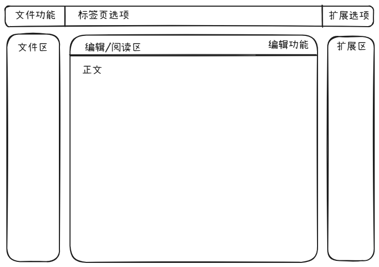

# 项目简介

这是一个个人前端项目练习项目，实现类Obsidian样式风格的markdown编辑器

# 基础功能介绍

1. 文件操作
    - 新建文件
    - 删除文件
    - 打开并查看文件
    - 修改文件
    - 保存文件
2. markdown支持
    - 支持markdown格式文字编辑
    - 提供markdown文件预览功能

# 样式示例

# 扩展功能

1. 文件操作扩展
    - 导出文件（markdown、pdf）
2. 使用逻辑扩展
    - 文件内关键字搜索
3. 样式扩展
    - 白天/黑夜模式转换
4. AI功能
    敬请期待